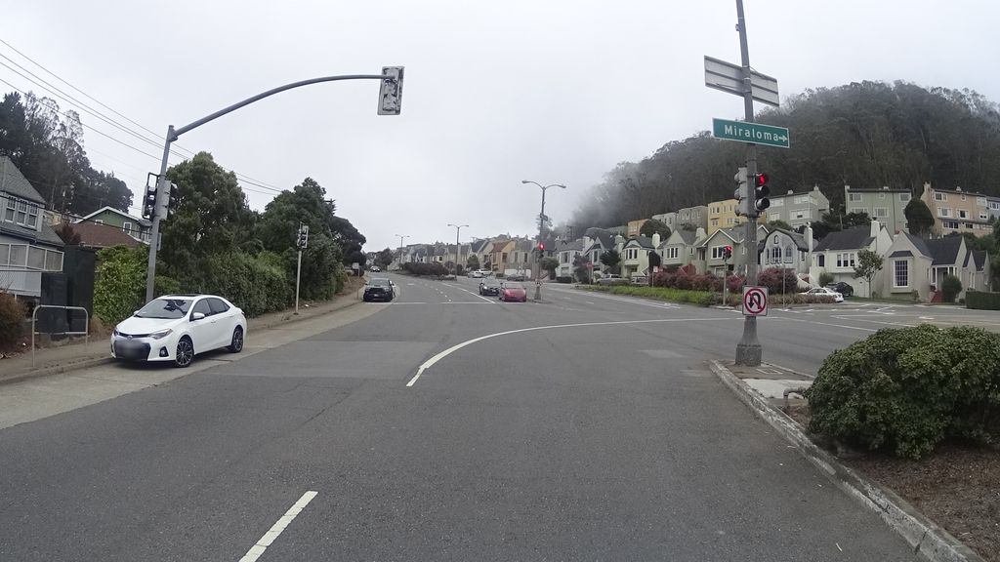

# Mapillary Snapshot Ingestion

A deployed Next.js and FastAPI prototype for querying Mapillary imagery by bounding box, storing local snapshots and metadata, and reviewing the collected street-level dataset in a web interface.

**Live application:** https://iml-prototype.vercel.app



[Mapillary capture 1100125150470143](https://www.mapillary.com/app/?pKey=1100125150470143) · [CC BY-SA 4.0](https://creativecommons.org/licenses/by-sa/4.0/)

## Workflow

1. Choose a geographic bounding box, an image limit, and an image type in the Next.js interface.
2. Submit the selection to the FastAPI ingestion endpoint.
3. The backend queries Mapillary, downloads each returned 1024px thumbnail, and records its location and camera metadata.
4. The interface reloads the locally stored dataset so its images and metadata can be reviewed without querying Mapillary again.

## Architecture

The Next.js frontend provides the ingestion form and stored-snapshot gallery. It calls the FastAPI service for ingestion and dataset reads. The FastAPI service wraps the Mapillary Graph API, persists JPEGs and a JSON index locally, and serves the stored images through `/api/mapillary/files`.

## API surface

### `POST /api/mapillary/ingest`

Queries Mapillary for images within a bounding box, downloads new 1024px snapshots, and stores metadata for every valid result. The request body accepts `bbox` (`west`, `south`, `east`, and `north`), an optional `limit`, and an optional `image_type` of `all`, `flat`, or `pano`. The response reports the query plus fetched, ingested, skipped, and failed counts.

### `GET /api/mapillary/snapshots`

Returns the locally stored snapshot metadata, ordered by most recent ingestion. Use the optional `limit` and `offset` query parameters for pagination. The response contains `total` and `items`.

### `GET /api/mapillary/snapshots/{image_id}`

Returns the metadata for one locally stored snapshot by its Mapillary image ID, or a `404` response when that ID is not in the local index.

## Local development

Install Git, Node.js 18+, pnpm, and Python 3.10+, then clone and enter the repository:

```bash
git clone https://github.com/Demetri65/iml-prototype.git
cd iml-prototype
```

Install the frontend dependencies and create a Python virtual environment:

```bash
pnpm install
python -m venv .venv
```

Activate the environment, install the backend dependencies, and run the app:

```bash
source .venv/bin/activate
pip install -r requirements.txt
pnpm dev
```

On Windows PowerShell, activate the environment with `.venv\\Scripts\\Activate.ps1`. Once both services start, open `http://localhost:3000`; FastAPI documentation is available at `http://localhost:8000/docs`.

## Data and credentials

`MAPILLARY_ACCESS_TOKEN` is required only for live ingestion. Set it in your shell or in a local `.env` file before submitting an ingestion request. Stored snapshots and their index live under `api/data/mapillary/`. The checked-in images are demonstration data, so the gallery can be reviewed without live ingestion credentials.

## Repository structure

```text
app/                         Next.js interface and page metadata
api/index.py                 FastAPI routes and ingestion orchestration
api/mapillary_client.py      Mapillary Graph API and image-download client
api/mapillary_store.py       Local JPEG and JSON-index persistence
api/data/mapillary/          Demonstration snapshots and metadata index
SETUP.md                     Detailed cross-platform setup instructions
```

## Current limitations

- Snapshot data is written to the local filesystem and is not reliably durable or synchronized across deployments or server instances.
- Live ingestion depends on a valid Mapillary access token and the availability of the Mapillary API.
- Bounding boxes are intentionally limited in size, and ingestion is capped to keep each request manageable.
- The gallery is a review surface for collected metadata and images; it does not yet provide map-based exploration, authentication, or durable cloud storage.
